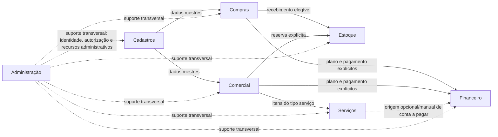

# Domínios de Negócio do Decor

## Objetivo

Este documento estabelece a taxonomia arquitetural dos módulos/domínios de negócio do Decor com base nas responsabilidades e capacidades identificadas no código atual e na auditoria de [Fluxos de Negócio do Decor](business-workflows.md). Registra o estado observado em 2026-09-30, na branch `audit/groups-permissions-redesign`.

O propósito é dar nomes estáveis às responsabilidades de negócio e às relações entre elas. Não é um inventário de classes, serviços, telas, permissões ou itens de navegação, nem afirma que cada capacidade descrita possa ser operada pela interface atual.

## Princípios de classificação

**Módulo de negócio não é sinônimo de serviço, entidade, formulário, permissão ou item de menu.**

**Módulo define responsabilidade de negócio. Fluxo define colaboração. Tela define ponto de entrada. Menu define navegação. Permissão define acesso.**

Aplicam-se ainda estes princípios:

- Um domínio reúne capacidades que atendem a uma responsabilidade de negócio coerente; não é definido pelo número ou nome de entidades e serviços.
- Um processo pode atravessar vários domínios. Essa colaboração não os funde em um módulo único.
- Dados mestres são classificados pela sua responsabilidade de sustentação dos processos, mesmo quando consumidos por muitos domínios.
- Uma entidade ou estado encontrado no código comprova, no máximo, aquela estrutura ou operação. Não comprova por si só um fluxo completo, automação, tela ou módulo autônomo.
- As relações descritas distinguem referências e operações explícitas de automações não localizadas. O documento não extrapola além das evidências registradas em `business-workflows.md`.
- O catálogo de permissões representa autorização e não é fonte para definir a arquitetura de negócio.

## Visão dos domínios

O fluxo abaixo mostra responsabilidades e colaborações confirmadas. A linha pontilhada para Administração representa seu caráter transversal; as demais conexões são relações de negócio identificadas, não uma sequência obrigatória nem garantia de automação.

## Cadastros

**Responsabilidade:** manter dados mestres que sustentam os processos e que são referenciados por um ou mais domínios.

**Capacidades confirmadas:** produtos, marcas, classificações hierárquicas, clientes, fornecedores, funcionários, parceiros, unidades de medida e locais de estoque. Há ainda estruturas auxiliares no backend, como atributos de especificação, componentes de kits, tabelas de preço por parceiro, formas de pagamento e motivos de ocorrência. Sua classificação como telas ou cadastros de navegação ainda depende da definição dos respectivos fluxos.

**Fluxo principal:** manter ou consultar dados mestres e disponibilizá-los aos processos que deles dependem. Produto e fornecedor são usados em compras; produto, cliente e classificação apoiam o Comercial; produto, unidade e local de estoque são referências para operações de estoque; funcionários e parceiros são usados, entre outras relações, em serviços e contas a pagar.

**Limites atuais:** os níveis de manutenção e de UI variam por cadastro. A interface permite manutenção de marcas, operações limitadas de produtos e consulta hierárquica de classificações. Vários outros cadastros têm suporte de backend sem tela correspondente. Atributos, kits e tabelas de preço não foram confirmados como processos completos na UI atual.

**Estado atual da implementação:** parcialmente implementado como domínio transversal. Há telas utilizáveis para algumas capacidades, mas não uma cobertura operacional uniforme dos dados mestres.

## Compras

**Responsabilidade:** tratar a aquisição de produtos e o recebimento associado.

**Capacidades confirmadas:** pedido de compra e itens, registro de recebimento por item, resultados de conferência/divergência e plano explícito de parcelas de compra. Um recebimento sem divergência destinado a depósito da empresa registra movimento de entrada no Estoque. Pagamento de parcela pode registrar despesa em conta-caixa.

**Fluxo principal:** dados de fornecedor e produto sustentam pedido e itens; o recebimento registra a conferência. Sob as condições confirmadas, o recebimento gera entrada no Estoque. O parcelamento é uma operação explícita posterior e seu pagamento integra-se ao Financeiro.

**Limites atuais:** não foi confirmado processo de aprovação de pedido de compra, fechamento automático do pedido, recebimento acumulado validado contra quantidade pedida ou geração automática de parcelas pelo pedido/recebimento. Recebimento destinado diretamente ao cliente não comprova expedição, baixa ou confirmação de entrega. O cancelamento de parcelas não foi encontrado como consequência automática de alteração/exclusão do pedido.

**Estado atual da implementação:** backend disponível, mas Compras ainda não possui UI operacional.

## Estoque

**Responsabilidade:** controlar saldos e registrar movimentações, transferências e reservas de estoque.

**Capacidades confirmadas:** movimentos de entrada, saída e ajuste; consulta de saldos e histórico; transferências entre locais com revisão de ciência/contestação; reservas relacionadas a itens elegíveis de pedidos comerciais. Um recebimento conferido pode gerar entrada sob as condições descritas em Compras.

**Fluxo principal:** uma operação explícita registra movimento e atualiza saldo; a transferência registra movimentos pareados e pode ser revisada; uma reserva elegível vincula quantidade disponível a item de pedido sem, por si só, movimentar o saldo.

**Limites atuais:** não há validação confirmada de saldo suficiente para saída nem processo completo de inventário físico. A reserva possui estado `Consumed`, mas não foi encontrada a transição que efetivamente consome a reserva. Não foi confirmado fluxo completo de separação, expedição e entrega, nem baixa automática de estoque por venda ou reserva.

**Estado atual da implementação:** backend disponível, mas Estoque ainda não possui UI operacional.

## Comercial

**Responsabilidade:** conduzir orçamento/cotação, pedido e operações comerciais relacionadas.

**Capacidades confirmadas:** orçamentos e seções, solicitações/revisões de cotação sob medida, conversão elegível de seção aprovada em pedido, aprovação/cancelamento de pedido, registro de envio de item elegível à produção, ocorrências, reservas solicitadas em operação separada e planos de parcelas de venda.

**Fluxo principal:** uma seção percorre operações explícitas de cotação, envio e aprovação; uma seção aprovada pode ser convertida em pedido pendente de aprovação. O pedido pode ser aprovado, receber operações posteriores explícitas, gerar reserva sob condição ou originar plano de parcelas em operação posterior. Itens de pedido cujo produto é serviço podem sustentar agendamento no domínio Serviços.

**Limites atuais:** converter orçamento não aprova o pedido, cria reserva ou cria parcelas. Aprovar pedido não cria reserva automaticamente. Não foram identificadas transições completas para produção, pronto para entrega, entrega parcial ou entregue; não foi confirmado ciclo completo de separação, expedição e entrega. Ocorrências podem registrar informações e prazos, mas não comprovam essas etapas. Parcelas de venda não são módulo autônomo.

**Estado atual da implementação:** há capacidades parciais no backend, mas Comercial ainda não possui UI operacional completa. O Termo de Entrega disponível na UI é uma lista temporária com exportação CSV, sem vínculo persistido ao pedido nem baixa de estoque ou confirmação de entrega; não constitui um processo completo de entrega.

## Serviços

**Responsabilidade:** agendar e registrar a execução de serviços associados a itens de pedido.

**Capacidades confirmadas:** agendamento para item cujo produto é do tipo serviço, atribuição de funcionário ou parceiro executor, verificação de conflito por dia, reagendamento com motivo e histórico, cancelamento em estados elegíveis e registro de execução. Registrar uma execução válida conclui o agendamento no mesmo fluxo de aplicação.

**Fluxo principal:** um item de serviço elegível permite agendamento com executor; reagendamentos e cancelamentos seguem operações e estados definidos; um registro de execução válido conclui o agendamento.

**Limites atuais:** não foi confirmado outro processo de serviços além de agendamento e execução descritos no auditado. A execução não atualiza automaticamente o pedido, estoque ou caixa. Um registro de execução pode ser informado como origem de conta a pagar, mas não a cria automaticamente.

**Estado atual da implementação:** backend disponível, mas Serviços ainda não possui UI operacional.

## Financeiro

**Responsabilidade:** tratar parcelas vinculadas a processos de origem, contas a pagar, contas-caixa e transações.

**Capacidades confirmadas:** planos de parcelas de compra e venda; contas a pagar; manutenção de contas-caixa; lançamentos de receita/despesa, transferências entre contas e consultas de saldo/extrato. Pagamentos de parcelas de venda podem registrar `Income`; pagamento de parcelas de compra ou contas a pagar pode registrar `Expense`.

**Fluxo principal:** parcelas e contas a pagar são pagas por operações explícitas que registram transação em conta-caixa e atualizam o respectivo estado. Lançamentos e transferências de caixa também são operações do backend.

**Limites atuais:** os planos de parcelas dependem das condições e processos de origem, não são módulos independentes. Não foi confirmado módulo autônomo de Contas a Receber: parcelas de venda e receitas em caixa não comprovam esse processo. Contas a pagar não são geradas automaticamente pelas origens citadas. Não foi encontrada emissão fiscal. As operações de lançamento e atualização de estado não constituem necessariamente uma única transação.

**Estado atual da implementação:** backend disponível, mas Financeiro ainda não possui UI operacional.

## Administração

**Responsabilidade:** manter usuários, grupos funcionais, autorização e recursos administrativos. Administração dá suporte transversal à operação, não representa uma etapa dos fluxos comerciais.

**Capacidades confirmadas:** recursos de usuários, grupos funcionais e autorização no backend, além de telas administrativas na aplicação. Os recursos de administração e segurança são separados das responsabilidades de Compras, Estoque, Comercial, Serviços e Financeiro.

**Fluxo principal:** manter recursos administrativos e aplicar autorização ao acesso às operações. Essa colaboração atravessa os domínios sem se inserir como etapa antes, durante ou depois de um processo comercial.

**Limites atuais:** permissões indicam acesso, não definem os domínios nem comprovam a existência de uma funcionalidade ou tela de negócio. A cobertura de UI e o alcance de cada recurso devem ser considerados conforme a implementação correspondente, sem inferir um processo comercial a partir do catálogo de autorização.

**Estado atual da implementação:** recursos administrativos e telas existem na aplicação auditada. Administração é transversal e não é etapa dos fluxos comerciais.

## O que não é módulo

Os itens abaixo podem ser dados mestres, etapas, componentes ou mecanismos de implementação. Isoladamente, nenhum define um domínio de negócio adicional:

- **Produto, Cliente, Fornecedor, Marca, Classificação, Unidade e Local de estoque:** dados mestres de Cadastros usados pelos processos.
- **Reserva e Recebimento:** capacidades/etapas dentro das colaborações de Estoque e Compras, respectivamente; não são módulos independentes.
- **Parcelas:** componentes financeiros relacionados aos processos de compra ou venda de origem; parcelas de compra/venda não constituem módulos independentes.
- **Pagamento:** operação que pode atualizar parcelas/contas e registrar transação financeira; não é um módulo por si só.
- **Transação de caixa:** registro/operação do domínio Financeiro, não módulo autônomo.
- **Agendamento e Registro de execução:** etapas/capacidades do domínio Serviços.
- **Ocorrência:** registro relacionado às operações do Comercial, não domínio autônomo.
- **Termo de Entrega:** funcionalidade atualmente parcial de lista temporária e exportação CSV. Não comprova entrega integrada e não deve ser classificado como Cadastro.
- **Serviços de aplicação:** componentes técnicos que implementam operações; sua separação em classes não determina a taxonomia de negócio.
- **Permissões:** mecanismo de autorização, não módulos nem prova de capacidades de negócio.
- **Views/ViewModels:** pontos de entrada e apresentação da UI, não domínios de negócio.
- **Itens de menu:** elementos de navegação, não definição da arquitetura de negócio.

## Relações entre os sete domínios

| Relação | Colaboração confirmada | Limite de interpretação |
| --- | --- | --- |
| Cadastros → Compras | Produto, fornecedor e referências de destino sustentam pedido/recebimento. | Referência de dados mestres. |
| Compras → Estoque | Recebimento sem divergência destinado a depósito da empresa pode gerar entrada e atualizar saldo. | Condicionado ao resultado e ao destino; não é qualquer recebimento. |
| Compras → Financeiro | Pedido elegível pode originar plano explícito de parcelas; pagamento registra despesa em caixa. | Não há criação automática de parcelas pelo recebimento. |
| Cadastros → Comercial | Produto e cliente são usados por orçamentos e pedidos. | Referência de dados mestres. |
| Comercial → Estoque | Pedido aprovado pode receber reserva em operação explícita; cancelamento libera reservas ativas. | Aprovação não reserva automaticamente e não foi encontrada transição de consumo. |
| Comercial → Serviços | Item de pedido associado a produto do tipo serviço é requisito para agendamento. | Associação operacional; não comprova UI nem processo adicional. |
| Comercial → Financeiro | Pedido aprovado pode originar plano explícito de parcelas; pagamento registra receita em caixa. | Conversão de orçamento não aprova pedido nem cria o plano. |
| Serviços → Financeiro | Registro de execução pode ser informado como origem de conta a pagar. | Referência opcional/manual; não gera conta automaticamente. |
| Administração → todos os domínios | Usuários e autorização dão suporte transversal ao acesso a recursos e operações. | Não é etapa de negócio nem fluxo comercial. |

As relações acima não implicam execução automática entre os domínios. O ponto de integração e as condições do fluxo devem ser verificados na capacidade correspondente, conforme detalhado em `business-workflows.md`.

## Módulo versus menu

A arquitetura interna não deve ser reproduzida simplesmente como uma árvore de navegação. Módulos agrupam responsabilidades; menus e telas organizam pontos de entrada para pessoas e tarefas. Um domínio pode aparecer em mais de um contexto de navegação, uma tela pode apoiar capacidades de mais de um domínio, e uma capacidade de backend pode não ter tela alguma.

Por isso, os sete domínios aprovados não prescrevem sete itens de menu, nem a existência de um menu prova que há um módulo completo. A navegação deve refletir tarefas e fluxos efetivamente disponíveis, sem usar a taxonomia como espelho mecânico da interface.

## Lacunas relevantes por módulo

| Domínio | Lacunas relevantes observadas |
| --- | --- |
| Cadastros | Cobertura desigual de manutenção e UI; vários dados mestres e capacidades auxiliares estão disponíveis apenas no backend. |
| Compras | Ainda não possui UI operacional; aprovação, fechamento automático, recebimento acumulado validado e integração automática de parcelas não foram confirmados. |
| Estoque | Ainda não possui UI operacional; não foi confirmado inventário físico completo, consumo de reserva, separação, expedição, entrega ou baixa completa por venda. |
| Comercial | Ainda não possui UI operacional completa; não foi confirmado ciclo completo de produção, expedição e entrega. O Termo de Entrega continua sendo apenas funcionalidade parcial de lista temporária/exportação CSV. |
| Serviços | Ainda não possui UI operacional; execução não integra automaticamente pedido, estoque ou caixa. |
| Financeiro | Ainda não possui UI operacional; não foi confirmado módulo autônomo de Contas a Receber nem emissão fiscal. |
| Administração | É transversal; não deve ser modelada como etapa dos fluxos comerciais nem inferida a partir do catálogo de permissões. |

## Conclusão arquitetural

A taxonomia de negócio do Decor é composta por **Cadastros, Compras, Estoque, Comercial, Serviços, Financeiro e Administração**. Os domínios de negócio operacionais — Compras, Estoque, Comercial, Serviços e Financeiro — colaboram entre si por meio de dados mestres, referências e operações explícitas. Cadastros fornece os dados mestres utilizados por esses fluxos. Administração fornece identidade, autorização e suporte transversal aos demais domínios.

Essa classificação descreve responsabilidades, não o estado de completude de uma solução ou de sua navegação. O código confirma capacidades implementadas no backend, mas Compras, Estoque, Serviços e Financeiro ainda não possuem UI operacional, e Comercial ainda não possui UI operacional completa. A evolução deve preservar os limites de cada domínio e tornar explícitas as integrações, sem promover entidades, serviços, telas, permissões ou itens de menu a módulos por conveniência técnica.
