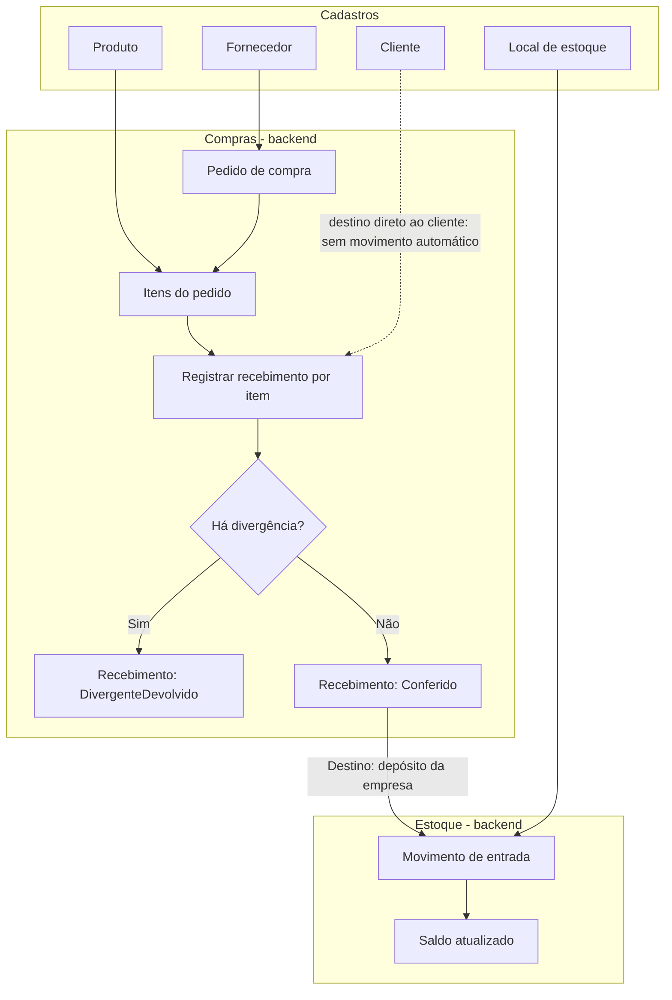
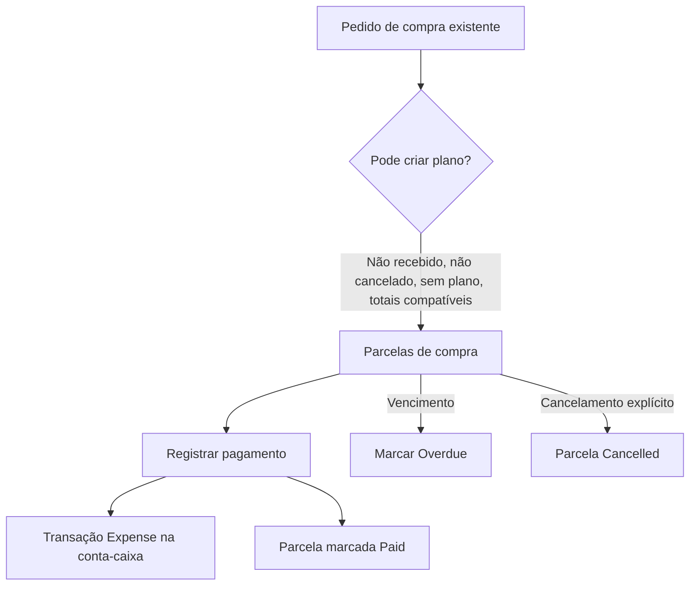
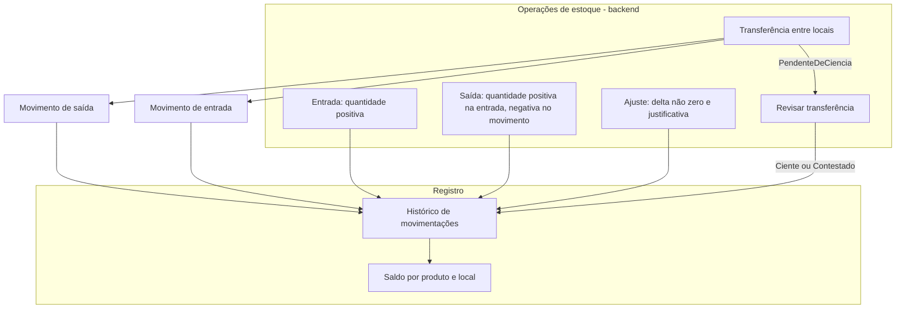
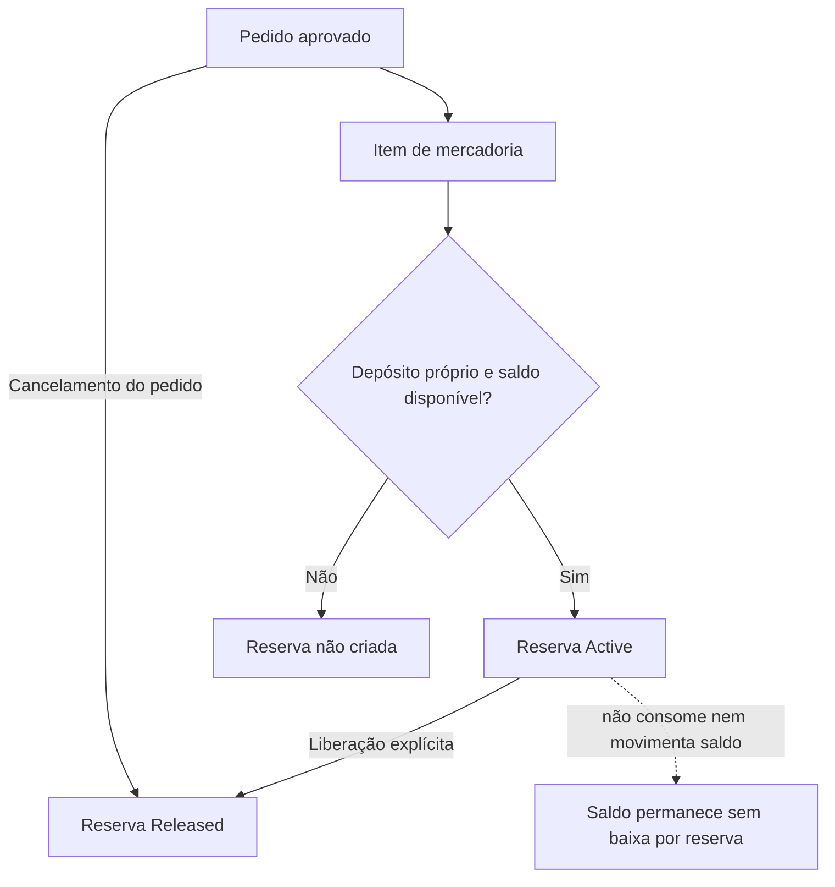
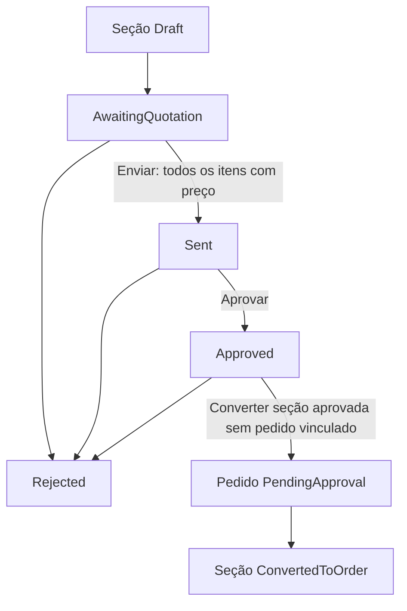
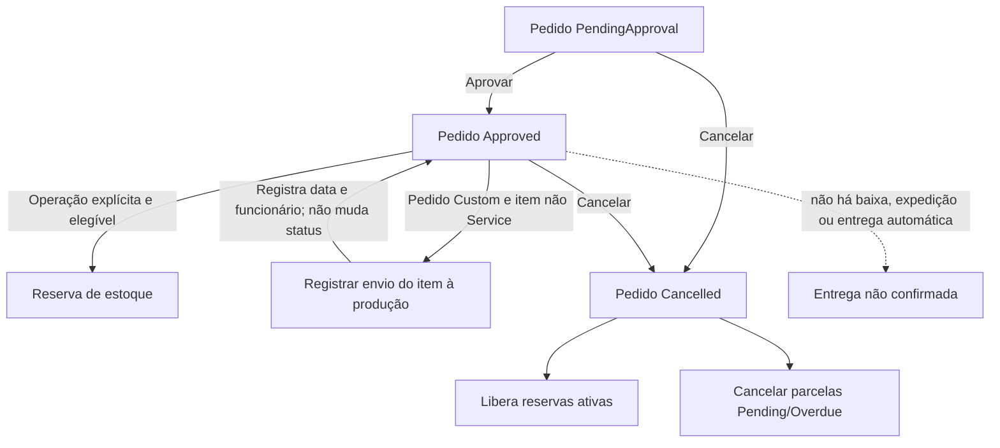
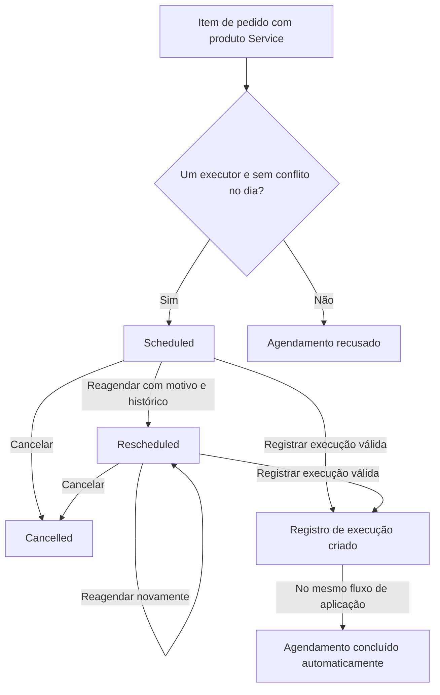
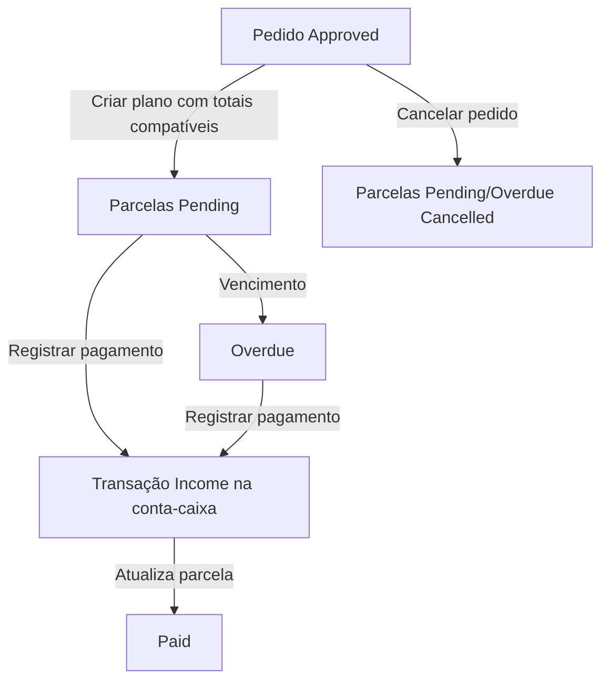
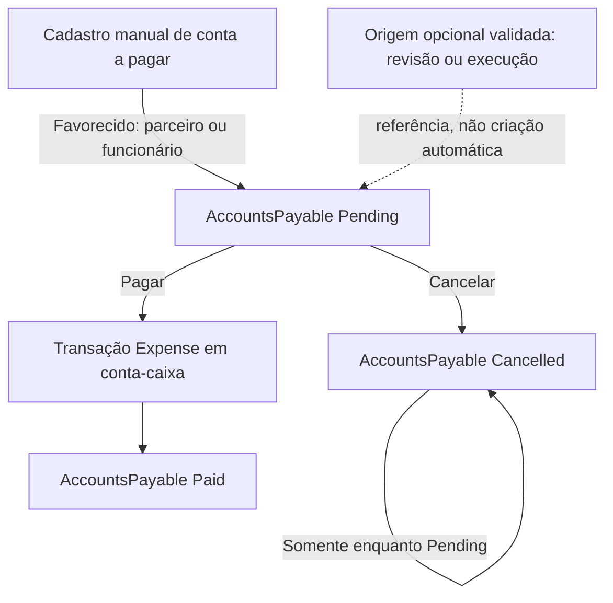
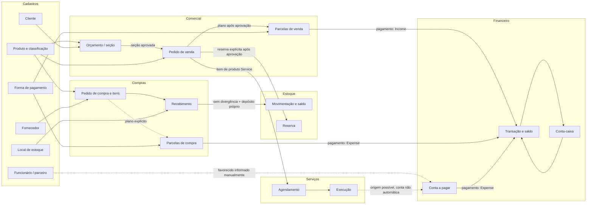

# Fluxos de Negócio do Decor

## Objetivo

Este documento registra como as capacidades presentes no código do Decor se relacionam em processos de negócio. Distingue os fluxos disponíveis no backend daqueles que podem ser operados pela interface Avalonia atualmente navegável. É uma fotografia do estado auditado em 2026-09-30, na branch `audit/groups-permissions-redesign`, commit `2782cda`.

## Como interpretar este documento

- **Cadastro** é um conjunto de dados mestres consumido por operações, como produto, cliente ou fornecedor.
- **Módulo/domínio** é uma área de negócio, como Compras, Estoque ou Comercial; não é necessariamente uma tela ou item de menu.
- **Funcionalidade** é uma capacidade do sistema, como registrar recebimento ou pesquisar produtos.
- **Etapa de fluxo** é uma operação que participa de um processo maior, como reservar estoque para um item de pedido.
- A existência de entidade, enum, serviço ou permissão, isoladamente, não comprova um fluxo de usuário completo.

Os diagramas representam somente relações e transições encontradas no código. Os elementos nomeados “Backend” não implicam que exista tela para acioná-los. O estado de interface considera as Views, ViewModels, registro de dependências e navegação atuais, não documentos de análise antigos.

### Classificação do estado

- **Implementado**: funcionalidade operável pela UI atual e comportamento confirmado no código.
- **Parcialmente implementado**: há etapas do processo, mas o fluxo completo não está demonstrado.
- **Backend disponível / UI ausente**: há operações de negócio no backend, sem interface correspondente na navegação atual.
- **Infraestrutura disponível**: há entidade, persistência ou suporte técnico, mas não foi confirmado um processo operacional completo.
- **Não implementado**: o processo não foi encontrado no estado auditado. Quando aplicável, a afirmação é limitada a “não confirmado no estado atual do projeto”.

## Estado da implementação

A aplicação Avalonia expõe telas de Produtos, Marcas, Classificações e Termo de Entrega, além de telas administrativas. As áreas de Compras, Estoque, Comercial, Serviços e Financeiro têm serviços, contratos, entidades e persistência, mas não têm Views/commands de negócio alcançáveis pela navegação atual.

| Domínio/capacidade | Estado atual |
| --- | --- |
| Produtos e marcas | **Implementado**, com limites próprios nas operações da tela; o cadastro de produtos na UI não cobre os tipos de produto existentes no backend. |
| Navegação de classificações | **Implementado** para consulta hierárquica; manutenção tem backend, mas não UI. |
| Termo de Entrega | **Parcialmente implementado** como lista temporária e exportação CSV; não constitui pedido, expedição ou confirmação de entrega. |
| Compras e recebimentos | **Backend disponível / UI ausente**; recebimento empresarial pode gerar entrada de estoque. |
| Movimentações e reservas de estoque | **Backend disponível / UI ausente**; há operações e consultas, sem fluxo de usuário na UI atual. |
| Orçamentos e pedidos comerciais | **Backend disponível / UI ausente**; há conversão, aprovação e cancelamento parciais, não um ciclo completo de entrega. |
| Agendamento e execução de serviços | **Backend disponível / UI ausente**; há estados e operações, sem UI operacional. |
| Parcelas, contas a pagar e caixa | **Backend disponível / UI ausente**; pagamentos podem gerar transações de caixa, sem UI financeira. |

## Visão geral dos domínios e módulos

- **Cadastros base**: produtos, marcas, classificações hierárquicas, clientes, fornecedores, funcionários, parceiros, unidades de medida e locais de estoque. As entidades têm diferentes níveis de suporte de UI.
- **Compras**: pedidos de compra, itens, recebimentos e parcelamento de compra.
- **Estoque**: saldos, movimentações, transferências e reservas vinculadas a itens de pedidos.
- **Comercial**: orçamentos/seções/itens, cotações sob medida, pedidos, ocorrências e parcelas de venda.
- **Serviços**: agendamentos de instalação e registros de execução.
- **Financeiro**: contas a pagar, parcelas de venda e compra, contas-caixa e transações.
- **Cadastros auxiliares de backend**: atributos de especificação, componentes de kits, tabelas de preço de parceiros, formas de pagamento e motivos de ocorrência. Não foi encontrado um fluxo de usuário/UI que os reúna em processos completos.
- **Administração e segurança**: usuários, grupos de permissões e autorização são suporte transversal, não etapas dos fluxos comerciais descritos aqui.

## Cadastros base

| Cadastro | Uso confirmado e estado da UI |
| --- | --- |
| Produto | Usado por compras, estoque, orçamento/pedido e serviços. O modelo diferencia `Good` e `Service`; a regra de negócio exige subgrupo e unidade de estoque para mercadoria e normaliza esses campos para serviço. A tela atual cria/salva mercadorias e não oferece todos os campos/capacidades do backend. |
| Marca | Cadastro com pesquisa, inclusão, edição e exclusão na UI. |
| Classificação | Hierarquia Classe → Família → Grupo → Subgrupo. A UI permite consulta/navegação; operações de manutenção existem no backend, sem comandos de edição na tela atual. |
| Cliente | Referenciado por orçamento/pedido e por compra com destino direto ao cliente. Serviço disponível no backend, sem tela de cadastro atual. |
| Fornecedor | Referenciado por pedido de compra. Serviço disponível no backend, sem tela de cadastro atual. |
| Funcionário e parceiro | Referenciados como executores de instalação e favorecidos de contas a pagar; também participam de operações identificadas pelo backend. Sem tela de cadastro atual. |
| Unidade de medida | Associada a mercadorias; o backend oferece ativação/desativação e manutenção, sem UI correspondente. |
| Local de estoque | Distingue local da empresa e de parceiro. Validações de tipo exigem parceiro para local de parceiro e impedem parceiro em local próprio. Sem UI correspondente. |
| Atributos, kits e tabelas de preço | Há serviços e persistência para atributos de especificação de produto, componentes de kit e tabelas de preço por parceiro/grupo. Não foi confirmado um fluxo completo ou UI atual para essas capacidades. |

**Estado dos cadastros:** **Parcialmente implementado** como conjunto. Marcas têm manutenção utilizável; produtos têm operações de UI limitadas; classificações são consultáveis; vários cadastros mestres existem somente no backend.

## Fluxos de negócio

### Compras

**Pedido e recebimento — Backend disponível / UI ausente; fluxo parcial.** O pedido e seus itens podem ser mantidos separadamente. O serviço de pedido não executa um processo de aprovação nem atualiza automaticamente o status agregado com base nos recebimentos. Os status declarados `Aberto`, `ParcialmenteRecebido`, `Recebido` e `Cancelado` não comprovam, por si, transições implementadas.

Cada recebimento exige quantidade positiva. Com divergência, exige observação e registra `DivergenteDevolvido`; sem divergência registra `Conferido`. Somente recebimento sem divergência destinado a depósito da empresa gera entrada de estoque. Recebimento com destino direto ao cliente não gera movimentação, baixa, entrega nem confirmação ao cliente neste fluxo. Também não foi encontrada validação acumulada contra a quantidade pedida nem atualização automática do status do pedido.

**Parcelamento de compra — Backend disponível / UI ausente; parcial.** Um plano pode ser criado se o pedido não estiver recebido ou cancelado, ainda não houver plano e a soma das parcelas corresponder ao total dos itens (tolerância de R$ 0,01). Forma de pagamento ativa e valores positivos são exigidos. Pagar uma parcela registra uma despesa na conta-caixa e marca a parcela como paga. Não há criação automática do plano pelo recebimento ou pelo pedido.

Não foi localizada chamada que cancele automaticamente as parcelas de compra ao excluir/alterar o pedido; o método de cancelamento de parcelas existe, mas não foi encontrada chamada de fluxo para ele.

### Estoque

**Movimentação — Backend disponível / UI ausente.** Entrada e saída exigem quantidade positiva; saída é registrada como quantidade negativa. Ajuste aceita delta diferente de zero e exige justificativa. O saldo é atualizado com a movimentação, sem validação de saldo suficiente para saída.

Transferências criam movimentos pareados identificados por `TransferID`, inicialmente `PendenteDeCiencia`. A revisão registra `Ciente` ou `Contestado`; contestar não reverte automaticamente os saldos. Consultas de saldo e histórico são operações do backend, não uma UI de inventário. **Não foi confirmado no estado atual do projeto um processo completo de inventário físico.**

**Reserva de estoque — Backend disponível / UI ausente; etapa associada ao pedido.** A reserva requer item de pedido aprovado, produto do tipo mercadoria, depósito da empresa e quantidade positiva. A quantidade não pode exceder saldo menos reservas ativas; permite uma reserva ativa por item. Criar ou liberar reserva não movimenta saldo. Cancelar pedido libera reservas ativas. Embora `Consumed` exista como estado, não foi encontrada transição para ele; não há baixa, expedição ou entrega automática.

### Comercial

**Orçamento → pedido — Tela de lançamento disponível.** Novo orçamento grava imediatamente o cabeçalho e uma seção `Catalog/Draft` na mesma transação, retornando o número gerado pelo banco. Cliente e vendedor podem ser selecionados depois; são obrigatórios para salvar o cabeçalho completo e converter. A tela apresenta catálogo em abas Produtos/Serviços, itens de todas as seções, subtotal, desconto monetário, total e observações. Itens são persistidos ao adicionar/atualizar; Salvar grava o cabeçalho e desconto. Voltar à listagem não exclui nem cancela o orçamento aberto. Gerar PDF salva os dados completos antes de exportar; Cancelar Orçamento marca as seções como `Rejected`, sem excluir o registro, e bloqueia orçamentos com seção convertida.

A abertura sem cliente/vendedor e o desconto exigem a migração `Migrations/20261006_add_open_quote_discount.sql`, além da migração de usuário criador `Migrations/20261005_add_quote_created_by_user.sql` quando ainda não aplicada.

A listagem de orçamentos é consultada ao abrir a tela, limpar a pesquisa e retornar do lançamento, e atualizada após salvar, cancelar ou converter. As origens disponíveis são Própria (1), Loja (2) e Outra (3); parceiro não é obrigatório. O catálogo inicia vazio e pesquisa após 300 ms sem novas teclas. Produtos e serviços são filtrados antes da paginação, com até 25 registros por página e apenas anterior/próximo. Quantidade usa campo numérico compacto sem setas, com unidade à direita: unidades que não permitem frações exigem inteiros; as demais aceitam até três casas, conforme `DECIMAL(12,3)`. A leitura dessas unidades usa permissões de orçamento, sem exigir acesso ao cadastro de unidades. Valor de Venda mostra quantidade vezes preço de venda por unidade; ao editar esse total, o preço por unidade é recalculado com duas casas decimais. Valor de Venda e desconto usam símbolo da moeda à direita e alinhamento numérico à direita. Observações mostram contagem de caracteres Unicode, sem expor bytes na tela; internamente preservam o limite de 65.535 bytes UTF-8 da coluna `TEXT`, mantendo caracteres completos ao truncar. Número, cliente, vendedor, pesquisa de produto e data têm ações integradas à altura do campo; a data abre um calendário como o agendamento de backup. Cabeçalho e catálogo ficam na coluna esquerda; itens e totais ocupam toda a coluna direita. O catálogo apresenta unidade de medida e preço de venda.

A última coluna dos itens permite remoção por lixeira, com permissão `Quotes.Edit`, apenas em seção `Draft` e sem conversão que bloqueie o rateio. O serviço exige que o item pertença ao orçamento e que o desconto continue compatível com o subtotal restante. Exclusão das especificações e do item ocorre na mesma transação; a tela recarrega itens e totais após sucesso. O resumo abaixo dos itens apresenta subtotal, desconto e total, seguido de observações com uma divisória.

**Busca de catálogo:** uma consulta somente numérica, inclusive com zeros à esquerda, pesquisa o código exato do produto. Nas consultas por palavras, cada palavra precisa corresponder à descrição, marca, código de barras, referência do fabricante ou código exato do produto. Por exemplo, `piso arquitech` combina descrição e marca; `piso arquitech estoque acima de 0` também exige saldo positivo. `com estoque` significa saldo maior que zero; `sem estoque`, saldo exatamente zero; `com estoque negativo` ou `estoque negativo`, saldo menor que zero. Comparações `estoque > 10`, `estoque < 0`, `estoque = 0`, `estoque acima de 10` e `estoque abaixo de 5` aceitam ponto ou vírgula decimal. Filtros podem ser combinados com descrição, marca e `tipo:produto`/`tipo:servico`; combinações contraditórias são rejeitadas. Não há correção automática de grafia, ranking semântico ou interpretação irrestrita de linguagem natural. Valores são parametrizados; o filtro de marca permite produtos e serviços sem marca cadastrada. Para novas tags, manter filtros tipados no parser, aliases de linguagem natural explícitos e testes de reconhecimento e SQL; futuras sugestões visuais devem inserir esses filtros na pesquisa, sem criar outro mecanismo de filtragem.

Uma seção percorre `Draft → AwaitingQuotation → Sent → Approved`; `Rejected` também é permitido a partir de `Draft`. A ação Converter em Pedido executa as transições pendentes usando as permissões de edição, envio, aprovação e conversão, sem ignorar as validações. Cada seção elegível gera um pedido separado; a conversão de várias seções não é uma transação única. O desconto é rateado nos preços unitários dos itens convertidos, com possível diferença de arredondamento para quantidades fracionárias. A conversão exige seção aprovada e sem pedido vinculado; cria pedido `PendingApproval`, copia itens e dados relacionados e marca a seção `ConvertedToOrder`. Converter não aprova o pedido, cria reserva ou cria parcelas.

Para seção sob medida (`Custom`), enviar requer solicitações de cotação associadas fechadas, quando a dependência de repositório está disponível. A resposta a uma revisão atualiza o preço do item; fechar solicitação requer ao menos uma revisão. Não foi encontrado um processo de aprovação de compra análogo para pedidos de venda; no pedido comercial a aprovação existe e só aceita `PendingApproval`.

**Pedido e operações posteriores — Backend disponível / UI ausente; parcialmente implementado.** Pedido aprovado pode receber reserva por chamada própria, mas aprovação não cria reserva automaticamente. Cancelamento só aceita `PendingApproval` ou `Approved`; salva o cancelamento e depois libera reservas ativas e cancela parcelas pendentes/vencidas. Essas operações relacionadas não formam uma única transação. Envio de item à produção só aceita pedido aprovado, seção `Custom` e item cujo produto não seja serviço; grava funcionário/data no item, sem mudar o status do pedido. Status como `InProduction`, `ReadyForDelivery`, `PartiallyDelivered` e `Delivered` não têm transições correspondentes identificadas no serviço.

Ocorrências podem ser registradas em pedido não cancelado, com motivo ativo e funcionário existente. Podem atualizar prazos de fabricação/instalação, mas não mudam status nem disparam estoque ou financeiro. **Não foi confirmado no estado atual do projeto um ciclo completo de produção, expedição ou entrega.**

**Termo de Entrega — Parcialmente implementado na UI, sem integração a pedido.** A tela permite localizar produto por código, acumular quantidades, remover item da lista temporária e exportar CSV com dados de cliente informados livremente. Não persiste documento/vínculo comercial e não registra saída de estoque ou confirmação de entrega. Não é uma etapa automática do pedido.

### Serviços

**Agendamento → execução — Backend disponível / UI ausente; fluxo parcial.** Agendar exige item de pedido cujo produto seja `Service` e exatamente um executor, funcionário ou parceiro. Conflito é verificado por executor e dia, considerando agendamentos programados/reagendados. Reagendar exige motivo e guarda histórico. Cancelar só aceita agendamento programado/reagendado. Registro de execução exige agendamento nesse estado e ausência de execução anterior; as validações de presença e confirmação são condicionais. Registrar a execução cria o registro e, no mesmo fluxo de aplicação, conclui automaticamente o agendamento.

Quando o cliente está presente, é obrigatório informar se assinou. Quando ausente, exige nota de autorização de ausência e não aceita confirmação assinada. Execução não atualiza status do pedido, estoque ou caixa automaticamente. **Não foi confirmado outro fluxo de serviços além de agendamento e registro de execução descritos acima.**

### Financeiro

**Parcelas de venda — Backend disponível / UI ausente; parcial.** A criação do plano exige pedido `Approved`, ausência de plano anterior, total de parcelas compatível com os itens (tolerância de R$ 0,01), valores positivos e forma de pagamento ativa. Pagamento de parcela `Pending` ou `Overdue` gera transação `Income` em conta-caixa e marca a parcela como `Paid`. Há operações para marcar vencimento e cancelar; cancelamento do pedido de venda cancela parcelas pendentes/vencidas.

**Não foi localizado módulo genérico/autônomo de Contas a Receber.** Há parcelas vinculadas a pedidos de venda e recebimento em caixa, mas isso não comprova um fluxo independente de contas a receber.

**Contas a pagar e caixa — Backend disponível / UI ausente; parcial.** Conta a pagar é criada manualmente como `Pending`, para favorecido existente do tipo parceiro ou funcionário. Origem é opcional; se preenchida, tipo e ID devem ser informados juntos. Origens verificadas incluem revisão de cotação sob medida e registro de execução de serviço, mas a origem não cria a conta automaticamente. Pagar conta pendente registra `Expense` na conta-caixa e depois marca a conta como `Paid`; cancelar só aceita conta pendente.

Contas-caixa podem ser mantidas/desativadas; o backend registra lançamentos avulsos `Income`/`Expense` de valor positivo e transferências entre contas diferentes (saída na origem e entrada no destino), e consulta saldo/extrato. Os serviços de pagamento e atualização de estado são etapas separadas, não uma única transação conjunta. Não foi encontrada emissão fiscal.

## Fluxos integrados

O diagrama sintetiza dependências confirmadas, e não uma sequência linear obrigatória. Linhas tracejadas indicam referência ou operação manual/opcional, não automação.

Relações importantes para não interpretar o diagrama como automação:

- A entrada de estoque por recebimento só ocorre sem divergência e quando o destino é depósito da empresa.
- Aprovar pedido não cria reserva; existe operação de reserva separada e condicionada ao saldo disponível.
- Conversão de orçamento não aprova pedido nem cria parcelas. Plano de venda é operação posterior para pedido aprovado.
- Recebimentos e execução de serviços não criam automaticamente contas a pagar.
- Pagamento de parcela/conta gera transação de caixa e atualização de estado em etapas separadas.

## Relação entre módulos

| Origem → destino | Relação confirmada | Natureza |
| --- | --- | --- |
| Cadastros → Compras | Produto, fornecedor e destino de recebimento referenciados por pedido/itens. | Dependência de dados mestres. |
| Compras → Estoque | Recebimento conferido sem divergência para local da empresa registra entrada e saldo. | Integração executada no backend, condicionada ao destino. |
| Cadastros → Comercial | Produto e cliente usados em orçamentos e pedidos. | Dependência de dados mestres. |
| Comercial → Estoque | Pedido aprovado permite reservar item de mercadoria, se houver saldo livre. Cancelamento libera reservas ativas. | Etapa explícita; não há consumo/baixa automática. |
| Comercial → Serviços | Item de pedido com produto do tipo serviço é requisito de agendamento. | Referência operacional. |
| Comercial → Financeiro | Pedido aprovado permite criar plano de parcelas de venda; pagamento lança `Income` em caixa. | Operação explícita no backend, sem UI. |
| Compras → Financeiro | Pedido elegível permite criar parcelas; pagamento lança `Expense` em caixa. | Operação explícita no backend, sem criação automática pelo recebimento. |
| Serviços → Financeiro | Registro de execução pode ser referência de origem informada em conta a pagar. | Relação opcional/manual; sem geração automática. |
| Financeiro → Caixa | Pagamentos de parcelas e contas a pagar geram transações; também há lançamentos e transferências. | Lançamento de caixa no backend. |

## Funcionalidades existentes sem fluxo completo

Estas capacidades foram encontradas no backend, mas não compõem por si só um fluxo de usuário completo na aplicação atual:

- Manutenção de clientes, fornecedores, funcionários, parceiros, unidades de medida e locais de estoque.
- Serviços de pedidos de compra, itens, recebimentos e parcelas de compra.
- Movimentações, saldos, transferências/revisões e reservas de estoque.
- Atributos de especificação, componentes de kit e tabelas de preço de parceiros.
- Orçamentos, solicitações e revisões de cotação sob medida, pedidos, ocorrências e parcelas de venda.
- Motivos de ocorrência e formas de pagamento.
- Agendamentos, reagendamentos, histórico e registros de execução de serviço.
- Contas a pagar, contas-caixa e transações financeiras.

## Lacunas e pontos ainda não definidos

- A UI atual não oferece operação navegável de Compras, Estoque, Comercial, Serviços ou Financeiro, apesar dos serviços e persistência encontrados.
- Estados declarados não equivalem a fluxo implementado: há status de pedido de compra/venda e reserva sem transições completas correspondentes no serviço.
- Não foi confirmado um processo de aprovação de pedido de compra.
- Recebimento direto ao cliente não comprova expedição, entrega ou confirmação; recebimentos divergentes não movimentam estoque.
- Não foi encontrado recebimento acumulado validado contra quantidade pedida nem fechamento automático do pedido de compra.
- Reserva não tem consumo identificado; não há baixa automática de estoque na venda, expedição ou ciclo completo de entrega.
- Envio de item à produção existe como registro limitado; produção completa e transições até pronto/entregue não foram confirmadas.
- Há parcelas de venda e lançamento de receitas em caixa, mas não foi localizado módulo genérico/autônomo de Contas a Receber.
- Conta a pagar pode apontar para origens de serviço/cotação, mas não é criada automaticamente por essas origens ou por pedido de compra.
- Não foi encontrada emissão fiscal; inventário completo também não foi confirmado no estado atual do projeto.
- O Termo de Entrega é um CSV baseado em dados temporários, sem vínculo persistido com pedido ou baixa de estoque.
- Cadastro de produto na UI não expõe o ciclo completo dos tipos de produto e recursos de serviço existentes no domínio.

## Referências ao código

Os links abaixo apontam às fontes auditadas; contratos de serviço e entidades complementam os serviços citados.

### Interface e navegação

- [`MainWindow.axaml`](../src/Decor.AvaloniaUI/MainWindow.axaml), [`MainViewModel.cs`](../src/Decor.AvaloniaUI/ViewModels/MainViewModel.cs) e [`Program.cs`](../src/Decor.AvaloniaUI/Program.cs): destinos navegáveis e registro das telas atuais.
- [`ProductsView.axaml`](../src/Decor.AvaloniaUI/Views/ProductsView.axaml) e [`ProductsViewModel.cs`](../src/Decor.AvaloniaUI/ViewModels/ProductsViewModel.cs): consulta e manutenção de produto exposta na UI.
- [`BrandsView.axaml`](../src/Decor.AvaloniaUI/Views/BrandsView.axaml) e [`BrandsViewModel.cs`](../src/Decor.AvaloniaUI/ViewModels/BrandsViewModel.cs): manutenção de marcas.
- [`ClassificationsView.axaml`](../src/Decor.AvaloniaUI/Views/ClassificationsView.axaml) e [`ClassificationsViewModel.cs`](../src/Decor.AvaloniaUI/ViewModels/ClassificationsViewModel.cs): navegação hierárquica de consulta.
- [`TermDeliveryView.axaml`](../src/Decor.AvaloniaUI/Views/TermDeliveryView.axaml) e [`TermDeliveryViewModel.cs`](../src/Decor.AvaloniaUI/ViewModels/TermDeliveryViewModel.cs): lista temporária e exportação CSV.

### Cadastros e apoio

- [`ProductService.cs`](../src/Decor.Application/Services/ProductService.cs), [`ProductRepositoryValidator.cs`](../src/Decor.Application/Validation/ProductRepositoryValidator.cs) e [`Product.cs`](../src/Decor.Core/Entities/Product.cs): tipos e regras de produto.
- [`BrandService.cs`](../src/Decor.Application/Services/BrandService.cs), [`ClassService.cs`](../src/Decor.Application/Services/ClassService.cs), [`FamilyService.cs`](../src/Decor.Application/Services/FamilyService.cs), [`GroupService.cs`](../src/Decor.Application/Services/GroupService.cs) e [`SubgroupService.cs`](../src/Decor.Application/Services/SubgroupService.cs).
- [`CustomerService.cs`](../src/Decor.Application/Services/CustomerService.cs), [`SupplierService.cs`](../src/Decor.Application/Services/SupplierService.cs), [`EmployeeService.cs`](../src/Decor.Application/Services/EmployeeService.cs), [`PartnerService.cs`](../src/Decor.Application/Services/PartnerService.cs), [`UnitOfMeasureService.cs`](../src/Decor.Application/Services/UnitOfMeasureService.cs) e [`StockLocationService.cs`](../src/Decor.Application/Services/StockLocationService.cs).
- [`ProductSpecificationAttributeService.cs`](../src/Decor.Application/Services/ProductSpecificationAttributeService.cs), [`ProductKitComponentService.cs`](../src/Decor.Application/Services/ProductKitComponentService.cs) e [`PartnerPriceTableService.cs`](../src/Decor.Application/Services/PartnerPriceTableService.cs).

### Compras e estoque

- [`PurchaseOrderService.cs`](../src/Decor.Application/Services/PurchaseOrderService.cs), [`PurchaseOrderItemService.cs`](../src/Decor.Application/Services/PurchaseOrderItemService.cs), [`PurchaseOrder.cs`](../src/Decor.Core/Entities/PurchaseOrder.cs) e [`PurchaseOrderItemRepositoryValidator.cs`](../src/Decor.Application/Validation/PurchaseOrderItemRepositoryValidator.cs).
- [`GoodsReceiptService.cs`](../src/Decor.Application/Services/GoodsReceiptService.cs), [`GoodsReceipt.cs`](../src/Decor.Core/Entities/GoodsReceipt.cs) e [`GoodsReceiptRepository.cs`](../src/Decor.Infrastructure/Data/Repositories/GoodsReceiptRepository.cs).
- [`StockMovementService.cs`](../src/Decor.Application/Services/StockMovementService.cs), [`StockMovement.cs`](../src/Decor.Core/Entities/StockMovement.cs) e [`StockMovementRepository.cs`](../src/Decor.Infrastructure/Data/Repositories/StockMovementRepository.cs).
- [`StockReservationService.cs`](../src/Decor.Application/Services/StockReservationService.cs) e [`StockReservation.cs`](../src/Decor.Core/Entities/StockReservation.cs).

### Comercial e serviços

- [`QuoteService.cs`](../src/Decor.Application/Services/QuoteService.cs), [`QuoteSection.cs`](../src/Decor.Core/Entities/QuoteSection.cs) e [`TailorQuotationService.cs`](../src/Decor.Application/Services/TailorQuotationService.cs).
- [`OrderService.cs`](../src/Decor.Application/Services/OrderService.cs), [`Order.cs`](../src/Decor.Core/Entities/Order.cs), [`OrderItem.cs`](../src/Decor.Core/Entities/OrderItem.cs) e [`OrderOccurrenceService.cs`](../src/Decor.Application/Services/OrderOccurrenceService.cs).
- [`InstallationAppointmentService.cs`](../src/Decor.Application/Services/InstallationAppointmentService.cs), [`InstallationAppointment.cs`](../src/Decor.Core/Entities/InstallationAppointment.cs), [`InstallationAppointmentRepository.cs`](../src/Decor.Infrastructure/Data/Repositories/InstallationAppointmentRepository.cs) e [`ServiceExecutionRecordService.cs`](../src/Decor.Application/Services/ServiceExecutionRecordService.cs).

### Financeiro

- [`OrderInstallmentService.cs`](../src/Decor.Application/Services/OrderInstallmentService.cs) e [`PurchaseOrderInstallmentService.cs`](../src/Decor.Application/Services/PurchaseOrderInstallmentService.cs).
- [`AccountsPayableService.cs`](../src/Decor.Application/Services/AccountsPayableService.cs) e [`AccountsPayable.cs`](../src/Decor.Core/Entities/AccountsPayable.cs).
- [`CashAccountService.cs`](../src/Decor.Application/Services/CashAccountService.cs), [`CashTransactionService.cs`](../src/Decor.Application/Services/CashTransactionService.cs) e [`CashTransaction.cs`](../src/Decor.Core/Entities/CashTransaction.cs).
- [`DecorPermissions.cs`](../src/Decor.Core/Common/DecorPermissions.cs) e os serviços de aplicação citados: permissões são verificadas como parte das operações, mas não constituem prova de tela ou fluxo de UI.